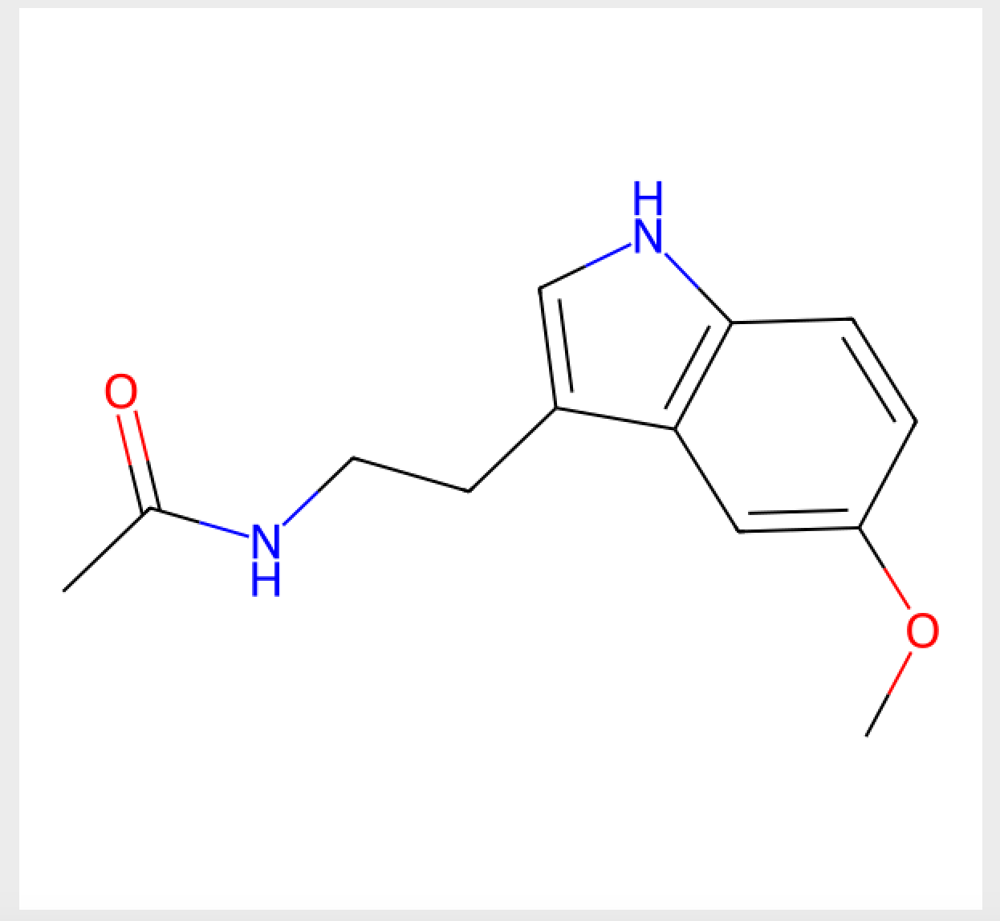
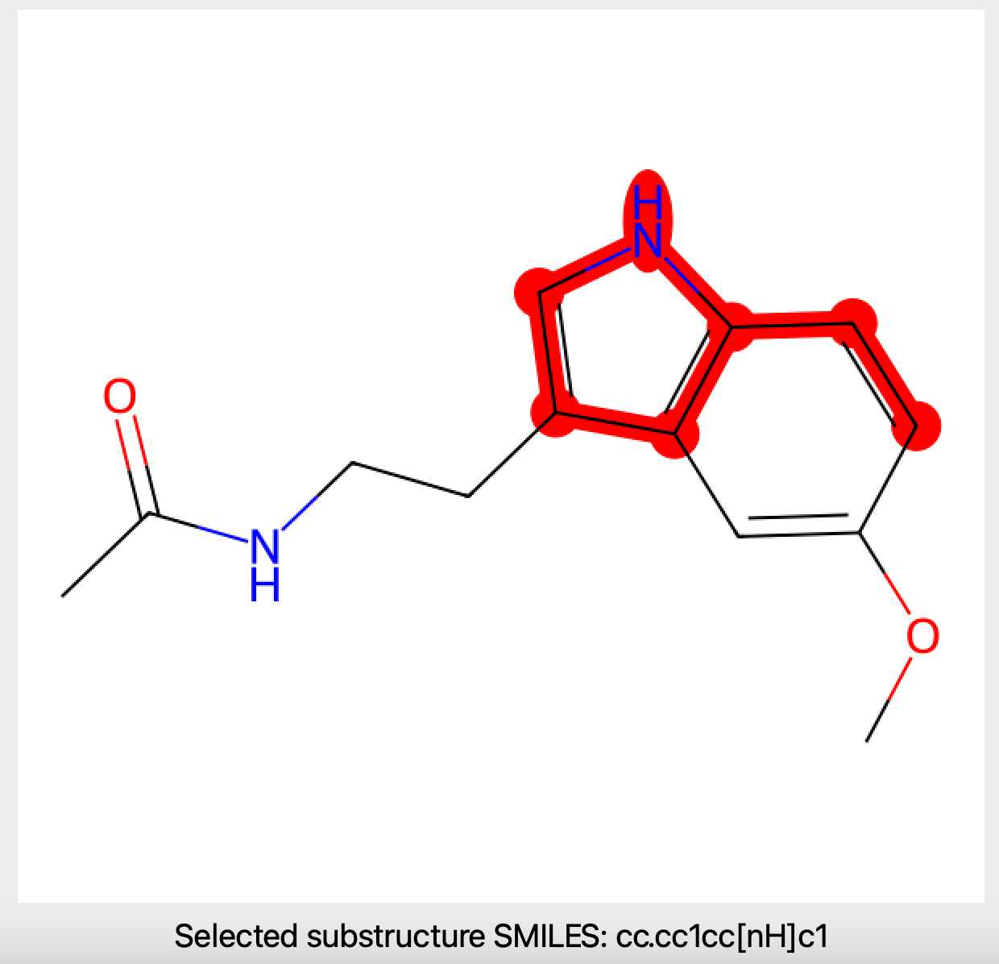

## A PyQt-based application that enables the user to highlight a substructure within a chemical compound. 

It is a simple application that I developed to be used in chemical compound design use cases. Before finalizing the application I moved to streamlit-based version and decided to open-source this one. 

- Start selection from the bottom right of your desired region
- When the mouse click event is released, the application finds the atoms in the highlighted region
- Using RDKit's Chem.PathToSubmol() and Chem.MolToSmiles() functions, the application finds the SMILES string of the highlighted region

Accepting the SMILES string as an argument can be a nice first step for improving this application.

